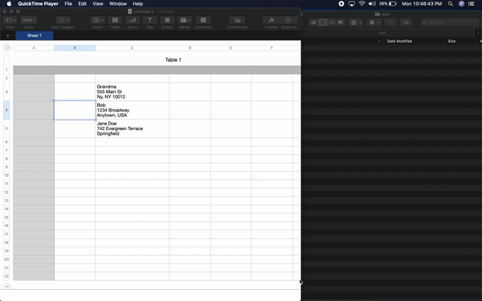

# AppleScripts
Apple Scripts I've written to help automate repetitive tasks.  This stuff was written in a hurry and most likely needs some updating.

# Show/hide Xcode Navigator, Debug Area, and Inspector 

This is so I can bind one hotkey to run the AppleScript to show/hide all 3 side windows in Xcode at once instead of using one hot key for each window.

# Creating Envelopes & Letters from Addresses

The script takes a set of selected cells from Numbers and creates documents in Pages, 1 envelope and 1 letter per address.  It requires a specifically named template with 2 placeholders with certain tags in it for the envelope.  When you run the script, you choose an output folder and then it will read the spreadsheet and script Pages into creating and saving the documents.

# Duplicating Resume & Coverletter in Pages

I structure my job application resumes & coverletters with the following directory structure:

job apps \ &lt;company name&gt; \ &lt;date and position applied for&gt; \ { coverletter doc name | resume doc name }
  
When I go to create a new one, it takes a few keystrokes and mouse clicks to 

* Duplicate the old one
* Create the new folder
* Update the location to the new folder
* Remove " copy" from the name, which Pages adds automatically
* Close the old documents
    
for each document.  This AppleScript automates that.
  

       
